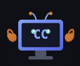

<p align="center">
  
</p>

<h1 align="center">CCclaw</h1>

<p align="center">让 AI 助手像专业程序员一样思考和工作。</p>

基于 [OpenClaw](https://github.com/openclaw/openclaw) 构建，整合了结构化的编程工作流规范、LSP 语言服务器、Jupyter Notebook 编辑等专业开发工具。

[](LICENSE)
[](https://nodejs.org)

---

## 为什么做这个

现有的 AI 编程助手有两个问题：

1. **没有章法** — 上来就改代码，改错了才发现思路不对
2. **缺乏专业工具** — 只能 grep 搜代码，不能精准跳转、查找引用

CCclaw 解决这两个问题：用工作流规范约束 AI 的行为，用专业工具提升 AI 的能力。

## 核心能力

### 🧭 结构化工作流

| 规则 | 效果 |
|------|------|
| **Plan Mode** | 复杂任务先探索 → 理解架构 → 出方案 → 等你确认，再动手 |
| **任务追踪** | 3 步以上自动创建清单，实时标记状态 |
| **只读探索** | 理解代码时禁止修改，避免手滑 |
| **Git 安全** | 禁止 `--force`、`reset --hard`，commit 流程规范化 |
| **善后检查** | 改完自动检查文档、测试、lint |

### 📋 专业开发工具

| 工具 | 能力 |
|------|------|
| **LSP 语言服务器** | 跳转定义、查找引用、类型信息、符号搜索、调用层级（8 种操作） |
| **Notebook 编辑** | Jupyter `.ipynb` 文件读写、cell 增删改（6 种操作） |
| **Brief 附件** | 消息附带文件/图片/日志 |

### 🧠 智能上下文管理

| 能力 | 说明 |
|------|------|
| **会话记忆** | 结构化模板，长对话不丢上下文 |
| **上下文压缩** | 智能压缩过长对话，保留关键信息 |
| **记忆提取** | 自动从对话中提取值得长期保存的信息 |

### 🌐 多渠道接入（继承 OpenClaw）

微信、飞书、QQ、Discord、Telegram、Slack、Signal 等 10+ 渠道。

## 安装

### 桌面版（推荐）

下载 .dmg 文件安装：

| 平台 | 下载 |
|------|------|
| macOS (M1/M2/M3/M4) | [CCCLAW-0.3.4-mac-arm64.dmg](https://github.com/badxtdss/CCclaw/releases/download/v0.3.4/CCCLAW-0.3.4-mac-arm64.dmg) |
| macOS (Intel) | [CCCLAW-0.3.4-mac-x64.dmg](https://github.com/badxtdss/CCclaw/releases/download/v0.3.4/CCCLAW-0.3.4-mac-x64.dmg) |

所有版本：[Release v0.3.4](https://github.com/badxtdss/CCclaw/releases/tag/v0.3.4)

### CLI 一行命令

```bash
curl -fsSL https://raw.githubusercontent.com/badxtdss/CCclaw/main/install.sh | bash
```

安装完成后：

```bash
ccclaw        # 打开 webchat（默认）
ccclaw start  # 启动服务
ccclaw stop   # 停止服务
ccclaw status # 查看状态
ccclaw update # 更新到最新版
```

**前置要求：** Node.js ≥ 18（https://nodejs.org）

**可选（LSP 语言服务器功能）：**
```bash
npm i -g typescript typescript-language-server
```

### 手动安装

```bash
git clone https://github.com/badxtdss/CCclaw.git ~/.ccclaw
cd ~/.ccclaw && bash install.sh
```

## 截图

<!-- 截图占位，后续补充 -->
> 截图待补充

## 使用示例

### 编程任务

```
你: "给这个 API 接口加一个错误重试机制"

CCclaw 的行为：
1. 📖 只读探索项目结构和现有代码
2. 📋 输出方案：在 middleware 层加 retry 装饰器
3. ⏳ 等你确认
4. ✅ 按依赖顺序修改文件
5. 🔍 用 LSP 检查调用方是否需要同步
6. 📝 按规范提交 commit
```

### LSP 工具

```bash
# 跳转到定义
node tools/cc-lsp/cc-lsp.mjs goto src/app.ts 42 15

# 查找所有引用
node tools/cc-lsp/cc-lsp.mjs refs src/utils.ts 10 8

# 符号搜索
node tools/cc-lsp/cc-lsp.mjs search . "sendMessage"

# 调用层级
node tools/cc-lsp/cc-lsp.mjs calls-in src/api.ts 25 10
```

### Notebook 编辑

```bash
# 查看结构
node tools/cc-notebook/cc-notebook.mjs list analysis.ipynb

# 替换 cell
node tools/cc-notebook/cc-notebook.mjs replace analysis.ipynb cell-2 "df.describe()"

# 插入新 cell
node tools/cc-notebook/cc-notebook.mjs insert analysis.ipynb markdown "## 结论"
```

## 项目结构

```
CCclaw/
├── AGENTS.md                  ← 14 个编程工作流规则
├── tools/
│   ├── cc-lsp/                ← LSP 语言服务器工具
│   ├── cc-notebook/           ← Jupyter Notebook 工具
│   └── cc-brief/              ← 附件发送工具
├── data/workspace/            ← 工作空间
├── start-ccclaw.sh            ← 启动脚本
└── 启动CCclaw.command         ← 双击启动器
```

## 与 OpenClaw 的关系

CCclaw = OpenClaw + 编程工作流规范 + 专业开发工具

OpenClaw 提供底层能力（Agent 循环、多渠道接入、记忆系统、定时任务等），CCclaw 在此基础上专注编程场景。

## 路线图

- [x] Plan Mode 工作流
- [x] LSP 语言服务器
- [x] Notebook 编辑
- [x] 上下文压缩
- [ ] 桌面应用（Tauri）
- [ ] 更多语言支持（Python LSP、Go LSP）
- [ ] 可视化工作流编辑器
- [ ] 团队协作模式

## 贡献

欢迎提交 Issue 和 PR！

## 许可证

[Apache License 2.0](LICENSE)

## 致谢

- [OpenClaw](https://github.com/openclaw/openclaw) — 基础框架（MIT License）
